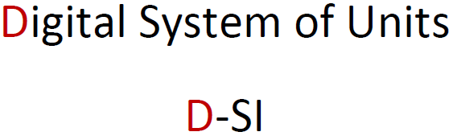

<h3>Online Guide for the use of the metadata-format used in metrology</h3>

 

  
   
  XSD Version 2.2.0
    

This Online Guide specifies the principles for the exchange of machine-readable data in eXtensible Markup Language (XML) for 
  all applications that transfer or require measurement data according to the specifications of 
  the Digital System of Units (D-SI) metadata model [[1]](https://doi.org/10.5281/zenodo.3816686).

**Features of D-SI XML implementation (XSD Version 2.2.0)** 
  * units of measure provided by SI units [[2]](https://www.bipm.org/en/publications/si-brochure)
  * kinds of quantities provided by QUDT (qudt.org)
  * structures for real quantities and fundamental constants
  * structures for complex quantities with Cartesian and polar coordinate form
  * structures for vector quantities of real, complex and list elements
  * structures for covariance matrix and various univariate and multivariate measurement uncertainty models
  * hybrid element structure for adaption non-SI units of measurement
  * memory saving list structure of real quantities
  * memory saving list structure of complex quantities

**Versions of the D-SI metadata model and the XML implementation**
The D-SI metadata model makes reccomendations for an unambiguous, universal, safe and uniform digital exchange of
metrological data indipendent from any specific format like binary data, XML, JSON etc. This XML implementation
supports version 1.3 of the D-SI metadata model [[1]](https://doi.org/10.5281/zenodo.3816686). The XML is defined through
an XML Schema Definition file (XSD). The version number of the XSD is 2.2.0 as this update introduced some breaking changes. 
For convenience, this documentation for version 2.2.0 will provide the relevant information from the underlying D-SI 
metadata model in closed form.

## Content of documentation

1. [Real quantity](wiki/doc/RealQuantity.md)
2. [Structure for SI units](wiki/doc/StructureSIUnits.md)
3. [Coverage regions](wiki/doc/CoverageRegions.md)
4. [Complex quantity](wiki/doc/ComplexQuantity.md)
5. [List Data Model (general)](wiki/doc/ListDataModel.md)
6. [List of real quantities](wiki/doc/RealList.md)
7. [List of complex quantities](wiki/doc/ComplexList.md)
8. [Structure for non-SI units (hybrid)](wiki/doc/Hybrid.md)
9. [Changes introduced by version 2.2.0](wiki/doc/Updates_2_2_0.md)

## Further examples and guidance

<!-- * [Example: Monte Carlo simulation data](wiki/doc/ExampleMonteCarloData.md) -->
* [Example: D-SI classification PLATINUM, GOLD, SILVER, BRONZE, IMPROVABLE](wiki/doc/ExampleD-SIClassification.md)<!-- * [Good practise: Temperature, Humidity, Pressure](wiki/doc/GoodPractiseTempHuPre.md) -->
* [Good practise: Uncertainty Calculation](wiki/doc/GoodPractiseConstantsUncertainty.md)
* [Uptake: Digital Calibration Certificate (redirection to PTB webpage)](https://www.ptb.de/dcc)
* [Uptake: Maschine-readable CODATA constants (redirection to Zenodo)](https://doi.org/10.5281/zenodo.3688428)
* [Uptake: TraCIM D-SI data classification (redirection to Zenodo)](https://doi.org/10.5281/zenodo.3953555)

## License

This repository contains the XML Schema Definition (XSD), a documentation and examples for the D-SI (Digital System of Units). 

The XSD is licensed by Physikalisch-Technische Bundesanstalt under [GNU LGPL v3](/COPYING.LESSER). 

The documentation and examples are licenced by Physikalisch-Technische Bundesanstalt under [Creative Commons Attribution 4.0 International License](wiki/WIKI.LICENSE).

## Liability

This XSD is distributed in the hope that it will be useful,
but WITHOUT ANY WARRANTY; without even the implied warranty of
MERCHANTABILITY or FITNESS FOR A PARTICULAR PURPOSE. See the
[GNU Lesser General Public License](/COPYING.LESSER) for more details.

## Citing the XSD

A citeable resource for this release is available under the DOI [10.5281/zenodo.3366901](https://doi.org/10.5281/zenodo.3366901) at Zenodo.

## Authors of documentation

D. Hutzschenreuter, Physikalisch-Technische Bundesanstalt

## Acknowledgement

**Version 2.2.0:** Thanks to all developers from PTB and our partners around the world for fruitful exchange on requirements and updates.

**Version 2.1.0:** Special thanks go to B. Gloger, J. Jagieniak from Physikalisch-Technische Bundesanstalt for their indispensable
support in preparation of the release.

**Version 2.0.0:** Special thanks go to C. Brown, B. Gloger, J. H. Loewe and J. Rethmeier from Physikalisch-Technische Bundesanstalt for their indispensable
support in preparation of the release.

The development of early versions of the XML scheme was part of the research project EMPIR 17IND02 (title: SmartCom). 
This project (17IND02) has received funding from the EMPIR programme, co-financed by the Participating States and 
from the European Union's Horizon 2020 research and innovation programme.

## References

[1] [SmartCom Digital System of Units (D-SI) Guide for the use of the metadata-format used in metrology for the easy-to-use, safe, harmonised and unambiguous digital transfer of metrological data](https://doi.org/10.5281/zenodo.3816686)

[2] [BIPM SI brochure 9th edition 2019](https://www.bipm.org/en/publications/si-brochure)

[3] [Project EMPIR 17IND02 SmartCom](https://www.ptb.de/empir2018/smartcom/project/)

---

 This documentation is licensed under a <a rel="license" href="http://creativecommons.org/licenses/by/4.0/">Creative Commons Attribution 4.0 International License</a>.
